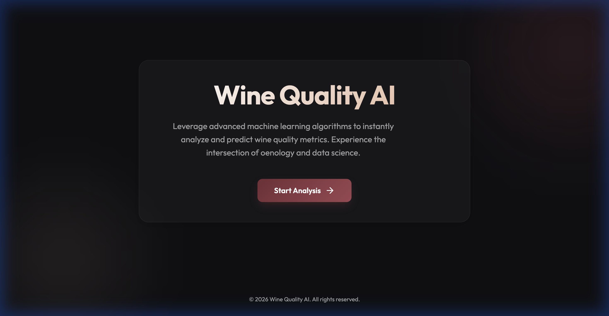
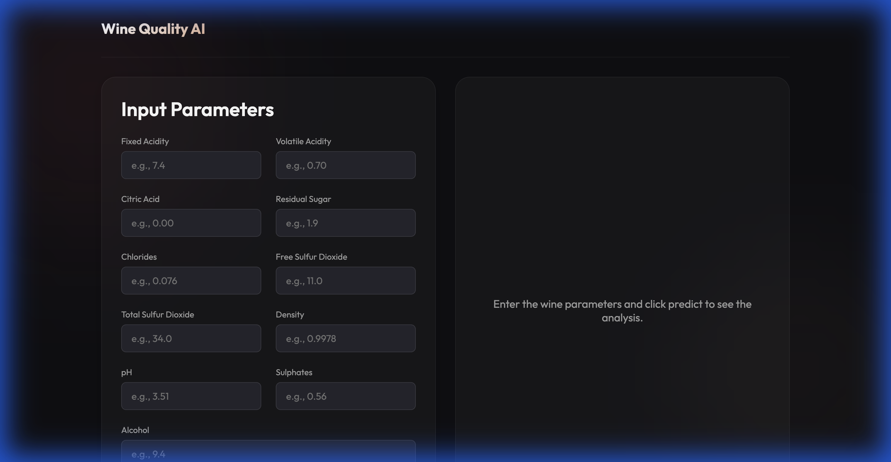
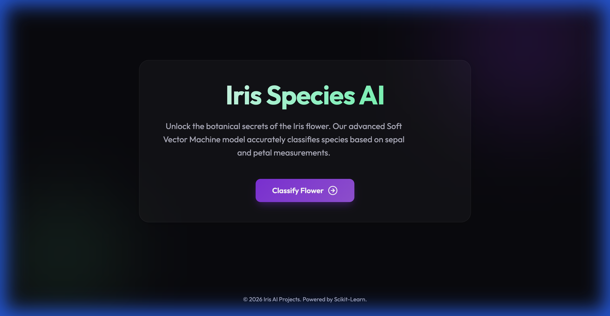
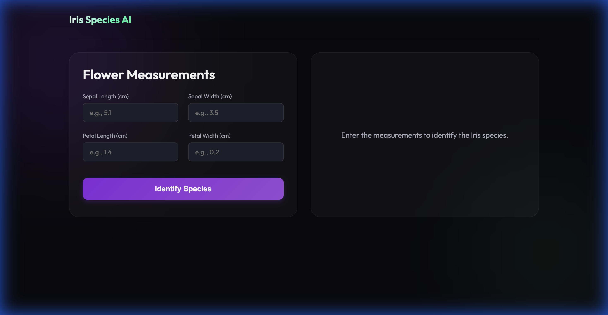

# DataDrills

A comprehensive collection of Machine Learning projects with modern, interactive web interfaces. This repository currently hosts two main applications:

1.  **Wine Quality AI**: A regression model to predict wine quality based on chemical properties.
2.  **Iris Species AI**: A classification model to identify Iris flower species.

---

## 📸 Project Showcase

### 1. Wine Quality AI
*Check the quality of your wine with precision.*

| Home Page | Prediction Interface |
|:---------:|:--------------------:|
|  |  |

### 2. Iris Species AI
*Identify flower species instantly.*

| Home Page | Prediction Interface |
|:---------:|:--------------------:|
|  |  |

---

## 🚀 Getting Started

### Prerequisites
*   Docker Desktop installed
*   Python 3.9+ (for local development)

### Running with Docker (Recommended)

#### Wine Classification App
To run the Wine Quality Predictor:

```bash
# Build the image
docker build -t wine-predictor ./WineClassification

# Run the container
docker run -p 8000:8000 wine-predictor
```
Access the app at: `http://localhost:8000`

#### Iris Species Classification App
To run the Iris Species Classifier:

```bash
# Build the image
docker build -t iris-classifier ./Iris

# Run the container (make sure to stop other containers using port 8000 first)
docker run -p 8000:8000 iris-classifier
```
Access the app at: `http://localhost:8000`

---

## 🛠️ Project Structure

```
DataDrills/
├── WineClassification/     # Wine Quality Project
│   ├── static/            # Frontend (HTML/CSS/JS)
│   ├── main.py            # FastAPI Backend
│   ├── train_model.py     # ML Training Script
│   ├── Dockerfile         # Container Configuration
│   └── ...
├── Iris/                   # Iris Species Project
│   ├── static/            # Frontend (HTML/CSS/JS)
│   ├── main.py            # FastAPI Backend
│   ├── model_train.py     # ML Training Script
│   ├── Dockerfile         # Container Configuration
│   └── ...
└── screenshots/            # Project Screenshots
```

## 🧪 Development

### Running Tests
To run the integration and unit tests for the Iris project:

```bash
# Install test dependencies
pip install pytest httpx

# Run tests
pytest Iris/test_integraion.py
```

## 📝 License
This project is open source and available under the [MIT License](LICENSE).
